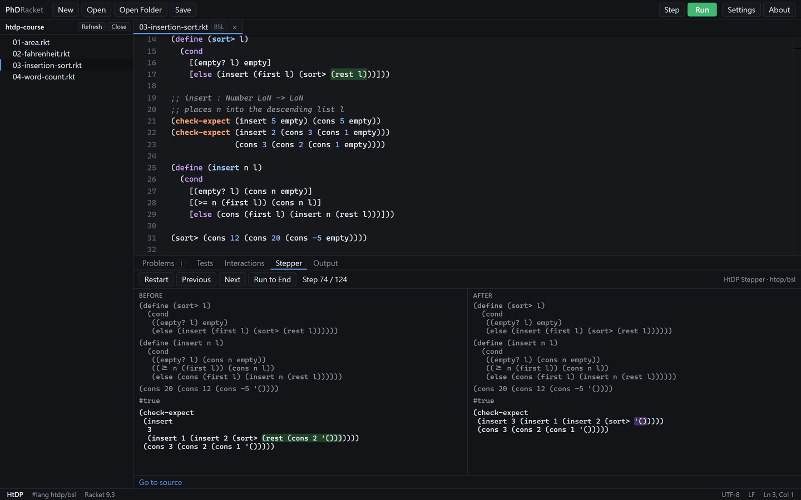
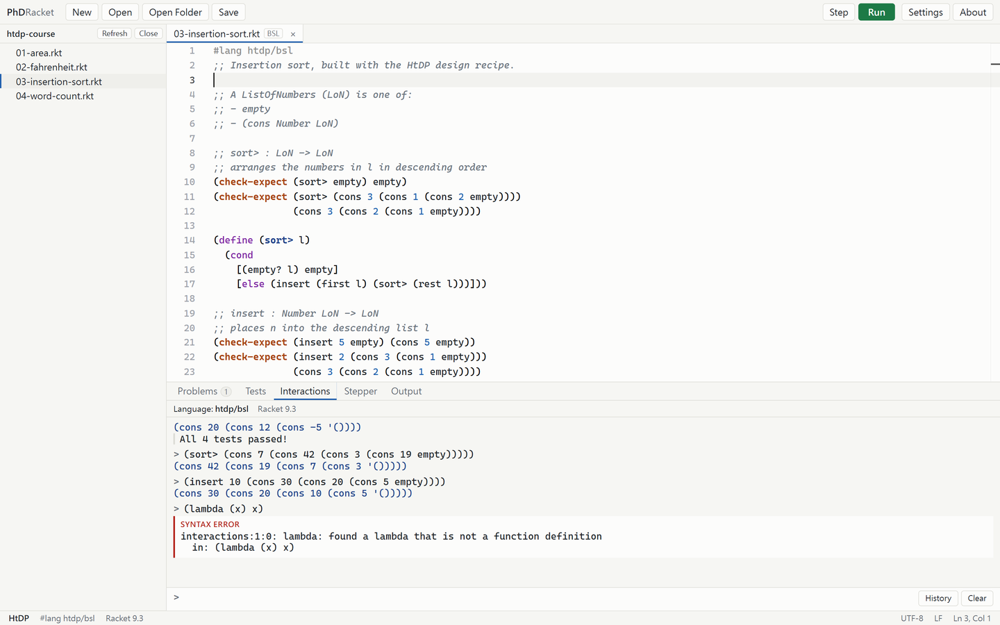
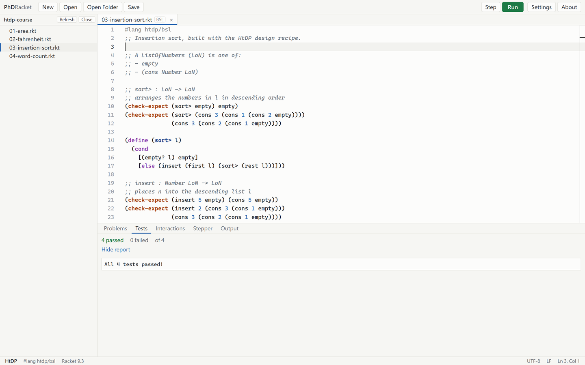
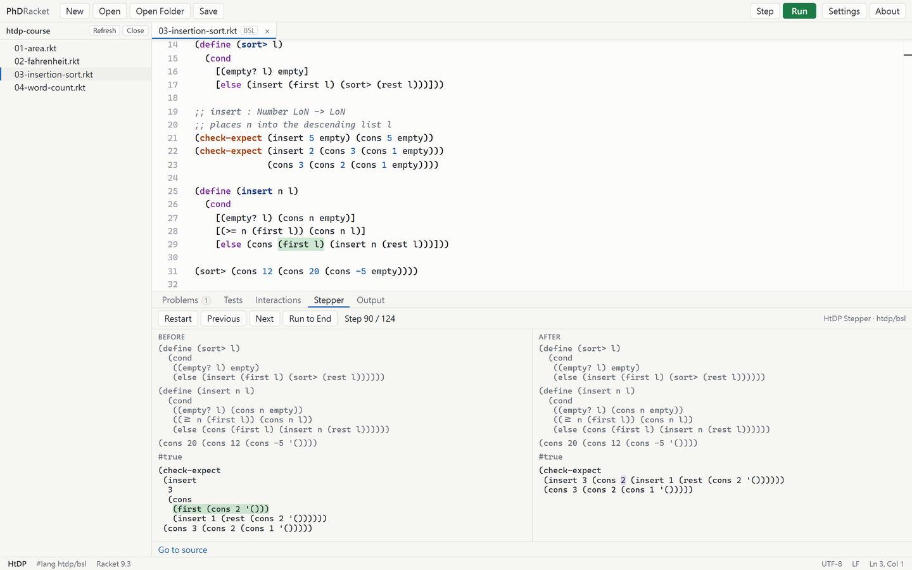
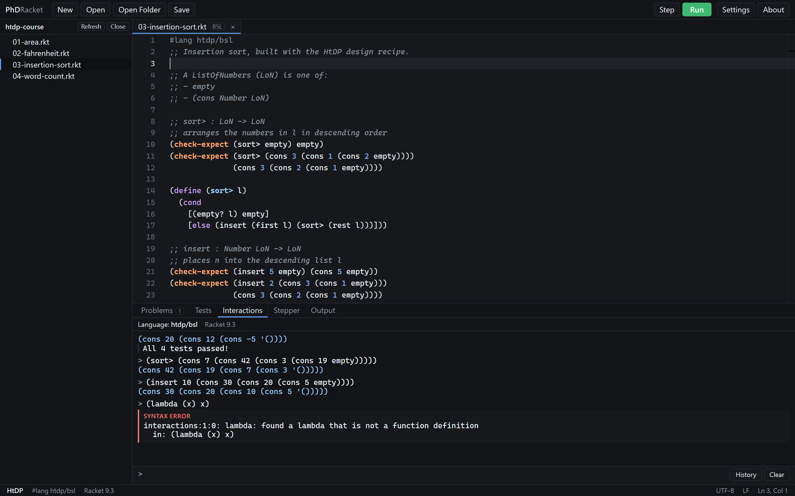

# Introducing PhDRacket: A Modern IDE for the HtDP Teaching Languages

PhDRacket is a desktop IDE for students who write course work in the *How to Design Programs* (HtDP) teaching languages. It runs programs in the official Racket installation on your computer, through the same HtDP entry points that DrRacket uses, and it keeps `.rkt` files exactly as DrRacket expects them. You can move between the two editors at any time.

What PhDRacket changes is the editing experience: tabs, a folder explorer, a modern editor, a dedicated test panel and an integrated Stepper.

This article walks through the main features using a small example: insertion sort written with the HtDP design recipe in `#lang htdp/bsl`, with a data definition, signatures, purpose statements and four `check-expect` tests.



## Definitions and Interactions



The layout follows the model HtDP courses already teach: Definitions in the editor, Interactions below.

- **Run** evaluates the Definitions in a fresh environment, prints the values of top-level expressions and runs every test.
- **Interactions** evaluate in that environment, with input history and multi-line input.
- **Stale-state notice.** If the Definitions change after a Run, the Interactions panel says so, so that new code is not tested against old definitions.
- **Teaching-language rules apply.** In the screenshot, Beginning Student rejects `lambda`. The error message comes from Racket itself, with its source location.

The folder explorer on the left opens an entire course or assignment directory, and files open in tabs.

## Tests



Results of `check-expect` and related forms are collected in a dedicated Tests panel that shows how many checks passed, how many failed and the total.

- Results come from the official HtDP test engine, not from a separate implementation.
- Each failure links to the check that failed.
- The original test report is always available.

## Stepper



The Stepper is one of the most effective tools in an HtDP course for understanding recursion. PhDRacket integrates the official HtDP Stepper in the bottom panel, without a separate window.

- **Complete history.** All steps are computed at once, so you can move forwards and backwards or jump to the end. The insertion-sort example produces 124 steps.
- **Side-by-side view.** Each step shows the expression before and after the reduction, with the rewritten subexpression highlighted on both sides.
- **Source highlighting.** The expression being evaluated is highlighted in the editor, and *Go to source* jumps to it.
- **Keyboard navigation** between steps.

In the first screenshot, `(sort> (cons 3 (cons 1 (cons 2 '()))))` has unfolded into `(insert 3 (insert 1 (insert 2 (sort> '()))))`, which makes it clear how the recursion builds up and how it then reduces back to a value.

## Editor



The editor is built on Monaco, the editor component of Visual Studio Code:

- find and replace, multiple cursors and bracket matching;
- light, dark and high-contrast themes, with configurable fonts;
- **Choose Language.** Click the language in the status bar to switch between the teaching languages and `#lang racket`. Only the language declaration changes, in the same format DrRacket writes, and the change can be undone.

## Compatibility with DrRacket

Compatibility is the central design principle of PhDRacket.

- **Official semantics.** Programs run in your installed Racket. PhDRacket contains no reimplementation of Racket.
- **Plain source files.** Saving an unedited file writes back exactly the same bytes. The language metadata that DrRacket writes at the top of a file is preserved, and nothing is ever added to your source. Both the DrRacket metadata format and `#lang htdp/bsl` are supported.
- **Course profiles.** Waterloo CS145, Waterloo CS135, Generic HtDP and Racket. A profile sets defaults such as the expected Racket version. It never changes what a program means.

## What PhDRacket does not do

PhDRacket contains no code generation, AI completion or assignment solving, and it does not connect to Marmoset or any other grading system. It cannot know private grading tests and never claims that a file will pass them.

Your code stays on your computer. PhDRacket needs no account and collects no telemetry. It connects to the network only to check for PhDRacket updates and announcements (both can be turned off in Settings) and, when you ask it to, to download the official Racket installer.

## Installation

**Quick install.** On macOS (Apple Silicon and Intel), run in Terminal:

```bash
curl -fsSL https://raw.githubusercontent.com/ouyang-matters/PhDRacket/main/install/install-macos.sh | bash
```

On Windows, run in PowerShell:

```powershell
irm https://raw.githubusercontent.com/ouyang-matters/PhDRacket/main/install/install-windows.ps1 | iex
```

The command downloads the latest release, verifies it against the checksum published by GitHub and installs it.

**Manual install.** Installers for Windows and macOS are available on the [Releases page](https://github.com/ouyang-matters/PhDRacket/releases).

On first launch, a Setup dialog shows the Beta Terms of Use and asks for your course and theme, with defaults already selected. If Racket is already installed, PhDRacket finds it. If not, *Install Racket 9.3* downloads the official installer from racket-lang.org, verifies it against the published checksum and installs it. Installed copies check for new versions at startup and update with one click.

---

PhDRacket is an independent open-source project released under the MIT License. It is not affiliated with or endorsed by the University of Waterloo or the Racket project. It is in early development; bug reports and feedback are welcome on [GitHub](https://github.com/ouyang-matters/PhDRacket/issues).
